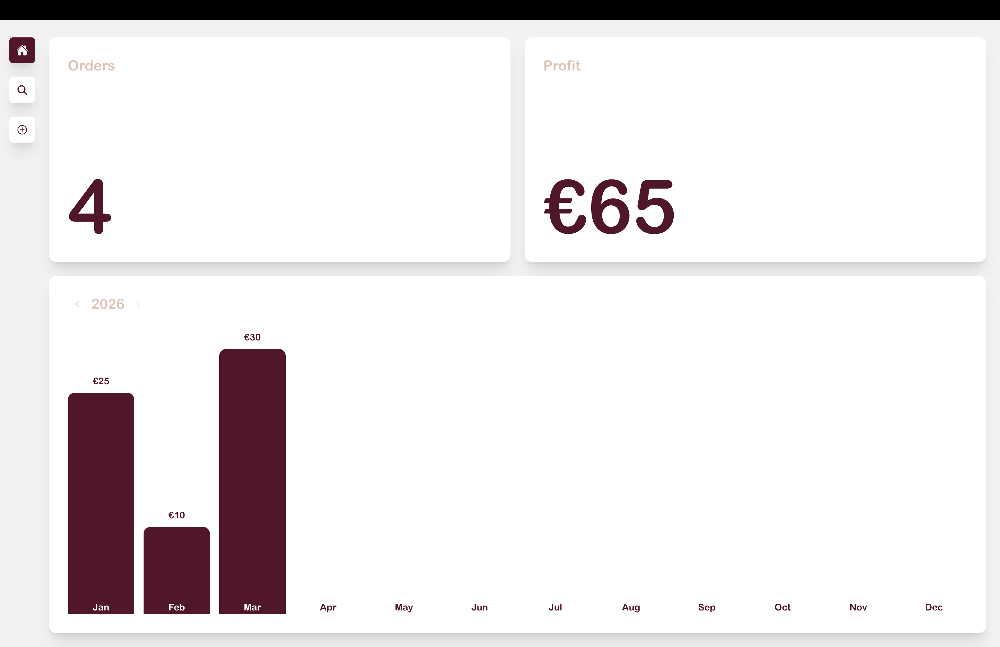
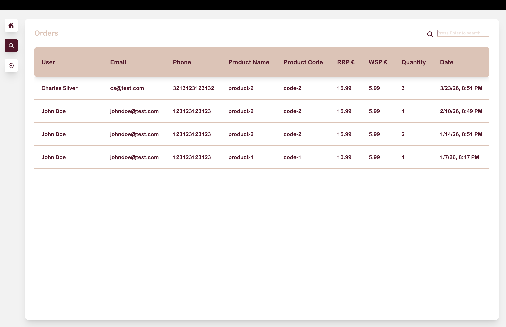
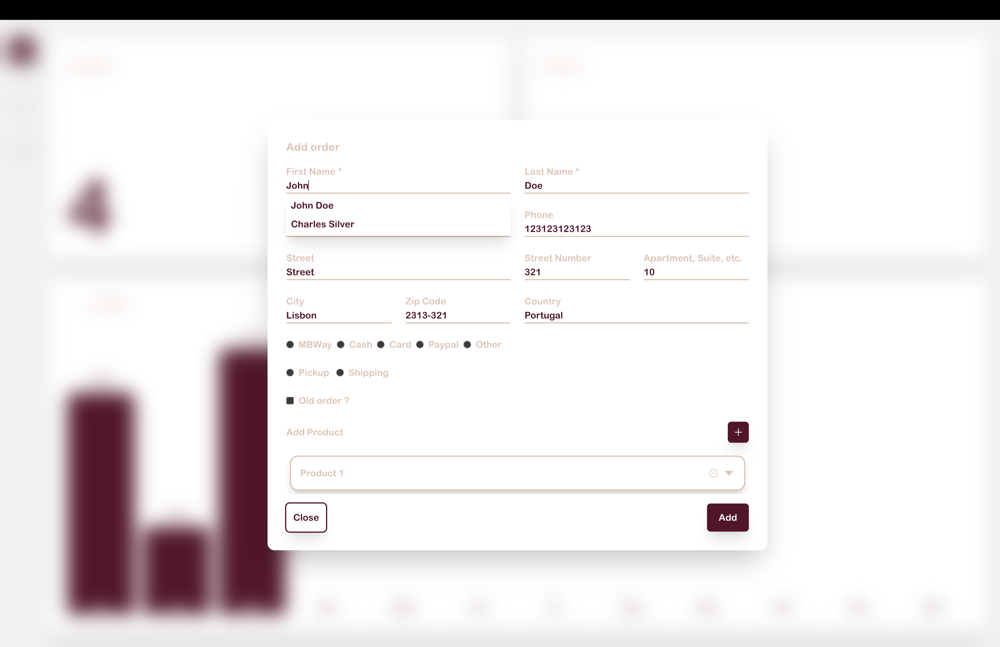

# Purchase Tracker

A desktop application for Boticário resellers to log and track customer orders, monitor profit, and search through purchase history. Everything runs locally - no internet connection or external service required.

<p align="center">
  
  
  
</p>

---

## What it does

- Register orders with customer details, products, payment method, and delivery type.
- Dashboard showing total orders and profit for the selected year, with a monthly breakdown chart.
- Search through all orders by customer name, email, phone, product name, or product code.
- Autocomplete on existing customers and products to avoid re-entering data.

---

## How it works

The app is an Electron window that runs a Go HTTP API in the background. The React frontend talks to it over `localhost:8080`. Data is stored in a SQLite file on your machine. On first launch, a database template is copied to the OS user data directory automatically.

When the app starts, Electron spawns the Go binary as a child process. When it closes, it kills it.

### Backend

Built with Go and Gin. Handles all data operations through a REST API under `/api/v1/`. It manages users, products, orders, and order items. Creating an order is a single request that includes the customer, products, payment, and delivery — the backend handles deduplication of customers and products internally.

### Frontend

Built with React, TypeScript, and Tailwind CSS. Two main pages:

- **Home** - yearly order count and profit summary, with a bar chart broken down by month. Use the arrows to navigate between years.
- **Search** - full table of all orders. Type a keyword and press Enter to filter by customer or product.

The Add Order button in the sidebar opens a modal to register a new order.

---

## Project structure

```
purchase-tracker/
  be/                   # Go backend
    cmd/api/            # HTTP server and route handlers
    cmd/migrate/        # Migration runner and SQL files
    cmd/seed/           # Fake data seeder
    internal/           # Database logic, models, and utilities
  fe/                   # Electron + React frontend
    electron/           # Main process (spawns backend, creates window)
    src/                # React app (pages, components, hooks, API calls)
    bin/                # Compiled Go binary (required before packaging)
    db/                 # SQLite template (copied to user data on first run)
```

---

## Requirements

- Go 1.21 or newer (with GCC, required for SQLite)
- Node.js 18 or newer

---

## Database

```bash
make upDB       # run migrations (creates all tables)
make downDB     # roll back all migrations
make resetDB    # downDB + upDB
make seedDB     # populate with fake data for testing
```

---

## Running in development

Install frontend dependencies once:

```bash
cd fe && npm install
```

Then in two separate terminals:

```bash
make run-be-mac   # or run-be-lin / run-be-win
make runFE
```

---

## Building for production

```bash
make desktop-mac   # macOS  → DMG
make desktop-lin   # Linux
make desktop-win   # Windows → NSIS installer
```

Output goes to `release/<version>/`.
